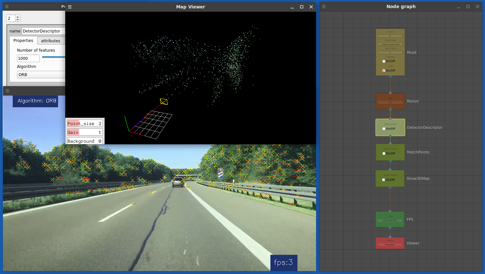

# SLAMBox
Training, research, development using Simultaneous localization and mapping (SLAM) method



### The following libraries are used in development:

**OpenCV** (Open Source Computer Vision Library) is a library of programming functions mainly aimed at real-time computer vision. Originally developed by Intel, it was later supported by Willow Garage then Itseez (which was later acquired by Intel). The library is cross-platform and free for use under the open-source Apache 2 License. Starting with 2011, OpenCV features GPU acceleration for real-time operations.

Some of the nodes presented in the program are made according to the lessons of the documentation for this library. Excellent documentation.

https://opencv.org/

**NumPy** is a library for the Python programming language, adding support for large, multi-dimensional arrays and matrices, along with a large collection of high-level mathematical functions to operate on these arrays.

https://numpy.org/

Image processing in Python **scikit-image** is a 
collection of algorithms for image processing.

https://scikit-image.org/

**Pangolin** is a set of lightweight and portable utility libraries for prototyping 3D, numeric or video based programs and algorithms. It is used quite widely in the field of Computer Vision as a means to remove platform-specific boilerplate and make it easy to visualize data.

https://github.com/stevenlovegrove/Pangolin

**Qt** is cross-platform software for creating graphical user interfaces as well as cross-platform applications that run on various software and hardware platforms such as Linux, Windows, macOS, Android or embedded systems with little or no change in the underlying codebase while still being a native application with native capabilities and speed.

https://en.wikipedia.org/wiki/Qt_(software)

**NodeGraphQt** a node graph UI framework written in python that can be implemented and re-purposed into applications supporting PySide2.

http://chantonic.com/NodeGraphQt/api/index.html

**FFmpeg** is a free and open-source software project consisting of a suite of libraries and programs for handling video, audio, and other multimedia files and streams.

https://ffmpeg.org/

### Dependent libraries (Fedora Linux 36 (x86-64), Ubuntu 22.04.2 LTS)

```
pip install numpy

pip install opencv-python

pip install opencv-contrib-python

pip install scikit-image

pip install PySide2

pip install Qt.py

pip install -U g2o-python

dnf install ffmpeg (apt install ffmpeg) for Ubuntu

git clone https://github.com/shrimo/NodeGraphQt.git

```

Build and Install Pangolin
```
git clone https://github.com/uoip/pangolin
cd pangolin
mkdir build
cd build
cmake ..
make -j4
cd ..
python setup.py install
```

