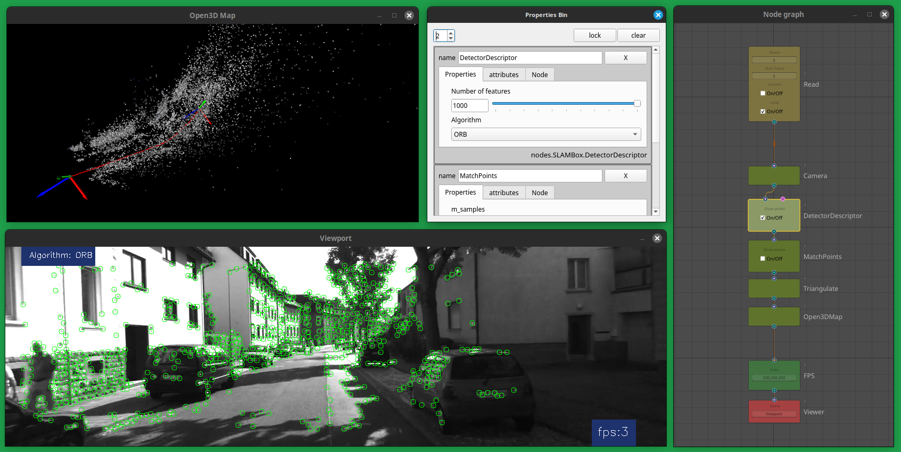

 
SLAMBOX is designed for use metod simultaneous localization and mapping ([SLAM][def]) in education, experiments, research and development by Node-based user interface. This is a box with tools that you can quickly and conveniently experiment with separate SLAM nodes. You can watch the demo here: [Demo video.](https://vimeo.com/881531969/eee24a6330)
 

 [examples/slambox_base.json](examples/slambox_base.json) 

## Introduction

In computing, a visual programming language (VPL) or block coding is a programming language that lets users create programs by manipulating program elements graphically rather than by specifying them textually. Visual programming allows programming with visual expressions, spatial arrangements of text and graphic symbols, used either as elements of syntax or secondary notation. For example, many VPLs (known as diagrammatic programming) are based on the idea of "boxes and arrows", where boxes or other screen objects are treated as entities, connected by arrows, lines or arcs which represent relations.

The development of robotics generates a request for recognition and control systems for data received from sensory devices. At present, development of Computer Vision systems requires developers to have knowledge of programming languages and a deep understanding of mathematics. It was like the development of computer graphics: at the beginning, only scientists and researchers were engaged in computer graphics, later applied tools ([Presented by such programs as Nuke, Houdini, Blender](https://en.wikipedia.org/wiki/Visual_programming_language)) were developed for use by less trained users. Over time, the development of computer vision systems should shift to the use of visual, graphical interfaces, such as Node-based UI, so that more ordinary users can access computer vision technologies.

The computer vision systems can be controlled not only by classical programming tools (write text code, which in itself narrows the scope of computer vision technologies), in the architecture of graph nodes it is possible to analyze and modify video streams, data from LIDAR, stereo cameras, acoustic sensors through visual programming, which expands the scope of technologies.

### Simultaneous localization and mapping

SLAM is the computational problem of constructing or updating a map of an unknown environment while simultaneously keeping track of an agent's location within it. While this initially appears to be a chicken or the egg problem, there are several algorithms known to solve it in, at least approximately, tractable time for certain environments. Popular approximate solution methods include the particle filter, extended Kalman filter, covariance intersection, and GraphSLAM. SLAM algorithms are based on concepts in computational geometry and computer vision, and are used in robot navigation, robotic mapping and odometry for virtual reality or augmented reality.

 

[Blender](https://www.blender.org/) 

## Design and main components of SLAM pipeline
Feature-based visual SLAM typically tracks points of interest through successive camera frames to triangulate the 3D position of the camera, this information is then used to build a 3D map.

The basic graph for SLAM in SLAMBOX consists of the following nodes: **Camera, DetectorDescriptor, MatchPoints, Triangulate, Open3DMap.** There are also nodes for optimization and elimination of erroneous feature points: **DNNMask, GeneralGraphOptimization, LineModelOptimization, KalmanFilterOptimization.**

#### Camera
- This node, based on the parameters, calculates [Camera Intrinsic Matrix][CameraMatrix]. Intrinsic parameters are specific to a camera. They include information like focal length *(Fx, Fy)* and optical centers *(Cx, Cy)*. The focal length and optical centers can be used to create a camera matrix, which can be used to remove distortion due to the lenses of a specific camera. The camera matrix is unique to a specific camera, so once calculated, it can be reused on other images taken by the same camera. It is expressed as a 3x3 matrix:

#### DetectorDescriptor
- [ORB](https://docs.opencv.org/4.x/d1/d89/tutorial_py_orb.html) (Oriented FAST and Rotated BRIEF)
- [AKAZE](https://docs.opencv.org/4.8.0/db/d70/tutorial_akaze_matching.html)  local features matching

#### MatchPoints
- [Brute-Force](https://docs.opencv.org/4.8.0/dc/dc3/tutorial_py_matcher.html) matcher is simple. It takes the descriptor of one feature in first set and is matched with all other features in second set using some distance calculation. And the closest one is returned.
- [RANSAC](https://en.wikipedia.org/wiki/Random_sample_consensus) (Random sample consensus) is an iterative method to estimate parameters of a mathematical model from a set of observed data that contains outliers, when outliers are to be accorded no influence on the values of the estimates. 

#### Triangulate
- The descriptors of the remaining features are then matched to the next frame, [triangulated](https://www.diva-portal.org/smash/get/diva2:1635583/FULLTEXT02.pdf) and filtered by their re-projection error. Matches are added as candidate tracks. Candidate tracks are searched after in the next frames and added as proper tracks if they are found and pass the re-projection test.

#### Open3DMap
- Here we get a point cloud, a camera and visualize them in a separate process using the Open3D library, it is also possible to record points in the [PCD](https://pointclouds.org/documentation/tutorials/pcd_file_format.html) (Point Cloud Data) file format.

#### DNNMask
- This node creates a mask for a detector/descriptor to cut off moving objects using [Deep Neural Networks](https://learnopencv.com/deep-learning-with-opencvs-dnn-module-a-definitive-guide/).

#### GeneralGraphOptimization
- Optimize a pose graph based on the nodes and edge constraints. This node contains three different methods that solve PGO, GaussNewton Levenberg-Marquardt and Powell’s Dogleg. It is mainly used to solve the SLAM problem in robotics and the bundle adjustment problems in computer vision. ORB-SLAM uses [g2o][def2] as a back-end for camera pose optimization.

 

 [examples/slambox_dnn.json](examples/slambox_dnn.json) 

## The following libraries are used in development

- [**OpenCV**](https://opencv.org/) (Open Source Computer Vision Library) is a library of programming functions mainly aimed at real-time computer vision. Originally developed by Intel, it was later supported by Willow Garage then Itseez (which was later acquired by Intel). The library is cross-platform and free for use under the open-source Apache 2 License. Starting with 2011, OpenCV features GPU acceleration for real-time operations. 

- [**NumPy**](https://numpy.org/) is a library for the Python programming language, adding support for large, multi-dimensional arrays and matrices, along with a large collection of high-level mathematical functions to operate on these arrays.

- [**g2o**][def2] is an open-source C++ framework for optimizing graph-based nonlinear error functions. g2o has been designed to be easily extensible to a wide range of problems and a new problem typically can be specified in a few lines of code. The current implementation provides solutions to several variants of SLAM and BA.

- [**scikit-image**](https://scikit-image.org/) Image processing in Python is a collection of algorithms for image processing.

- [**SciPy**](https://scipy.org/) (pronounced “Sigh Pie”) is an open-source software for mathematics, science, and engineering.

- [**Open3D**](http://www.open3d.org/) is an open-source library that supports rapid development of software that deals with 3D data. The Open3D frontend exposes a set of carefully selected data structures and algorithms in both C++ and Python.

- [**Qt**](https://wiki.qt.io/Qt_for_Python) is cross-platform software for creating graphical user interfaces as well as cross-platform applications that run on various software and hardware platforms such as Linux, Windows, macOS, Android or embedded systems with little or no change in the underlying codebase while still being a native application with native capabilities and speed.

- [**NodeGraphQt**](http://chantonic.com/NodeGraphQt/api/index.html) a node graph UI framework written in python that can be implemented and re-purposed into applications supporting PySide2.

- [**FFmpeg**](https://ffmpeg.org/) is a free and open-source software project consisting of a suite of libraries and programs for handling video, audio, and other multimedia files and streams.

 
 

 [examples/slambox_g2o.json](examples/slambox_g2o.json) 

### Dependent libraries 

- `pip install numpy`

- `pip install opencv-python`

- `pip install opencv-contrib-python`

- `pip3 install open3d`

- `pip install scikit-image`

- `pip install scipy`

- `pip install -U g2o-python`

- `pip install PySide2`

- `pip install Qt.py`

- `dnf install ffmpeg`

 

**g2o** framework for Python can also be build from [source code](https://github.com/RainerKuemmerle/g2o/tree/pymem), also add path to the compiled library in file *config.py*, see the *g2opy_path* variable.
 

*SLAMBOX is distributed in the hope that it will be useful, but there is no guarantee that it will work perfectly. There are no warranty as to its quality or suitability for a particular purpose. Our primary development platform is Linux and Python 3.10 (Fedora Linux 36-39, Ubuntu 22). Has been tested on Mac OS X 10.15 (Only the AKAZE descriptor works; the ORB detector still works with errors.)*

### Installation and launch

- `cd ~/your_fav_code_directory`
- `git clone https://github.com/shrimo/SLAMBox.git`
- `cd SLAMBox`
- `chmod 777 slambox.sh`
- `./slambox.sh`

 

[Based on twitchslam by geohot](https://github.com/geohot/twitchslam)

:rocket:

[def]: https://en.wikipedia.org/wiki/Simultaneous_localization_and_mapping
[CameraMatrix]: https://docs.opencv.org/4.x/dc/dbb/tutorial_py_calibration.html
[def2]: https://github.com/RainerKuemmerle/g2o