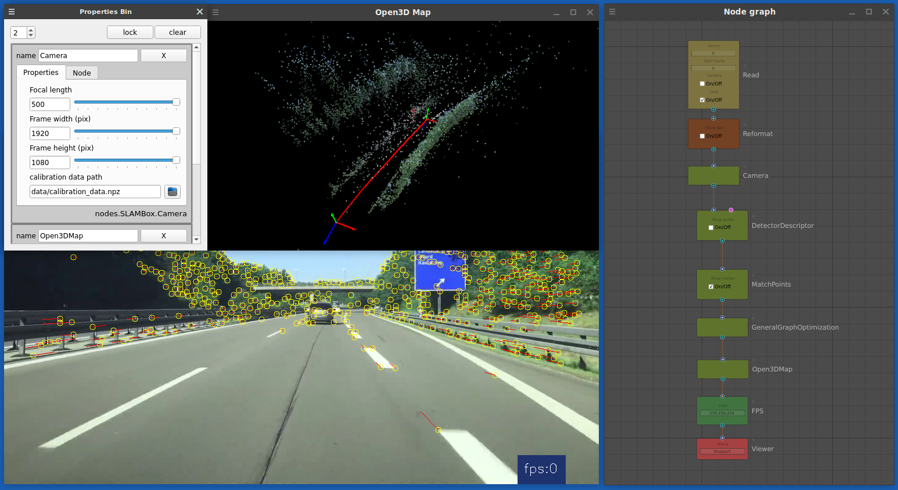

# SLAMBox
This application is designed for use metod simultaneous localization and mapping (SLAM) in education, research and development by Node-based ui.



[Demo video](https://vimeo.com/878101688/42d5fa7642)

### Introduction

The development of robotics generates a request for recognition and control systems for data received from sensory devices. At present, development of Computer Vision systems requires developers to have knowledge of programming languages and a deep understanding of mathematics. It was like the development of computer graphics:  at the beginning, only scientists and researchers were engaged in computer graphics, later applied tools [(Presented by such programs as Nuke, Houdini, Blender)](https://en.wikipedia.org/wiki/Visual_programming_language) were developed for use by less trained users. Over time, the development of computer vision systems should shift to the use of visual, graphical interfaces, such as Node-based UI, so that more ordinary users can access computer vision technologies.

The computer vision systems can be controlled not only by classical programming tools (write text code, which in itself narrows the scope of computer vision technologies), in the architecture of graph nodes it is possible to analyze and modify video streams, data from LIDAR, stereo cameras, acoustic sensors through visual programming, which expands the scope of technologies.

In computing, a visual programming language (VPL) or block coding is a programming language that lets users create programs by manipulating program elements graphically rather than by specifying them textually. Visual programming allows programming with visual expressions, spatial arrangements of text and graphic symbols, used either as elements of syntax or secondary notation. For example, many VPLs (known as diagrammatic programming) are based on the idea of "boxes and arrows", where boxes or other screen objects are treated as entities, connected by arrows, lines or arcs which represent relations.

In this study, we study the availability of open source libraries and frameworks, we also study existing solutions, develop a prototype program for applying computer vision methods to video streams and other data coming from the sensor of digital devices.


### [Simultaneous localization and mapping][def]

Simultaneous localization and mapping **(SLAM)** is the computational problem of constructing or updating a map of an unknown environment while simultaneously keeping track of an agent's location within it. While this initially appears to be a chicken or the egg problem, there are several algorithms known to solve it in, at least approximately, tractable time for certain environments. Popular approximate solution methods include the particle filter, extended Kalman filter, covariance intersection, and GraphSLAM. SLAM algorithms are based on concepts in computational geometry and computer vision, and are used in robot navigation, robotic mapping and odometry for virtual reality or augmented reality.


### The following libraries are used in development:

**OpenCV** (Open Source Computer Vision Library) is a library of programming functions mainly aimed at real-time computer vision. Originally developed by Intel, it was later supported by Willow Garage then Itseez (which was later acquired by Intel). The library is cross-platform and free for use under the open-source Apache 2 License. Starting with 2011, OpenCV features GPU acceleration for real-time operations.

Some of the nodes presented in the program are made according to the lessons of the documentation for this library. Excellent documentation.

https://opencv.org/

**NumPy** is a library for the Python programming language, adding support for large, multi-dimensional arrays and matrices, along with a large collection of high-level mathematical functions to operate on these arrays.

https://numpy.org/

Image processing in Python **scikit-image** is a 
collection of algorithms for image processing.

https://scikit-image.org/

**SciPy** (pronounced “Sigh Pie”) is an open-source software for mathematics, science, and engineering.

https://scipy.org/

**g2o** is an open-source C++ framework for optimizing graph-based nonlinear error functions. g2o has been designed to be easily extensible to a wide range of problems and a new problem typically can be specified in a few lines of code. The current implementation provides solutions to several variants of SLAM and BA.

https://github.com/RainerKuemmerle/g2o

**Open3D** is an open-source library that supports rapid development of software that deals with 3D data. The Open3D frontend exposes a set of carefully selected data structures and algorithms in both C++ and Python.

http://www.open3d.org/

**Qt** is cross-platform software for creating graphical user interfaces as well as cross-platform applications that run on various software and hardware platforms such as Linux, Windows, macOS, Android or embedded systems with little or no change in the underlying codebase while still being a native application with native capabilities and speed.

https://en.wikipedia.org/wiki/Qt_(software)

**NodeGraphQt** a node graph UI framework written in python that can be implemented and re-purposed into applications supporting PySide2.

http://chantonic.com/NodeGraphQt/api/index.html

**FFmpeg** is a free and open-source software project consisting of a suite of libraries and programs for handling video, audio, and other multimedia files and streams.

https://ffmpeg.org/


### Dependent libraries (Fedora Linux 36 (x86-64), Ubuntu 22.04.2 LTS,  Mac OS X 10.15+)

```
pip install numpy

pip install opencv-python

pip install opencv-contrib-python

pip3 install open3d

pip install scikit-image

pip install scipy

pip install -U g2o-python

pip install PySide2

pip install Qt.py

dnf install ffmpeg (apt install ffmpeg) for Ubuntu
```

### Installation and launch

```
cd ~/your_fav_code_directory
git clone https://github.com/shrimo/SLAMBox.git
cd SLAMBox
./slambox.sh
```


Based on twitchslam by geohot (https://github.com/geohot/twitchslam)

:rocket:

[def]: https://en.wikipedia.org/wiki/Simultaneous_localization_and_mapping